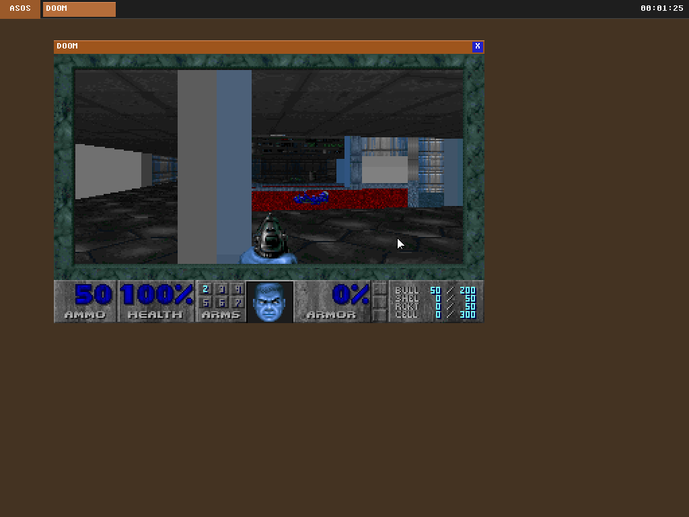

# ASOS

ASOS is a vibe coded, hobbyist-driven, independent OS — built from scratch to answer the question: how hard can it be? Starting from UEFI firmware, it grows into a preemptive multitasking x86-64 kernel with its own filesystem, window manager, and desktop environment — no Linux, no libc, no safety net




## DOOM
To play DOOM, you will need to add the doom1.wad file in user/DOOM

### Languages of choice
- Assembly
- C
- All C++ used is strictly part of the DOOM game

### Limitations
- This currently only works in a VM. An uplift project will be needed to support standalone machine execution which includes things like multiple more drivers, a USB stack, and a USB HID driver, which is a much bigger project than the whole current kernel
- No TCP/IP stack, or any network driver implemented for that matter
- Desktop environment is very limited (e.g no minimize/maximize windows)

## Architecture
```
Boot
├── UEFI Bootloader — gnu-efi, framebuffer/memory map, page tables, jump to kernel
└── Shared Boot Info — struct passed from bootloader to kernel

Kernel Core
├── Entry — BSS clear, init all subsystems, stack switch, launch first user process
├── Panic — kpanic(): print, halt
├── Memory Management
│   ├── PMM — bitmap frame allocator, 4 KB pages, zeroed frames
│   ├── VMM — 4-level page tables, per-process address spaces
│   └── Heap — free-list kmalloc/kfree, 16 MB
├── CPU Tables & Interrupts
│   ├── GDT/TSS — kernel/user segments, double-fault stack
│   └── IDT/ISR — 256 vectors, exception + IRQ dispatch
├── Hardware Drivers
│   ├── Serial (COM1), PIC, PIT (1000 Hz tick)
│   ├── PS/2 Keyboard + Mouse
│   └── ATA PIO disk driver
├── Filesystem
│   ├── GPT partition table parser
│   ├── FAT32 read/write with subdirectories
│   └── VFS layer with full path resolution
├── Process Management
│   ├── Preemptive round-robin scheduler (20 ms slices)
│   ├── ELF64 loader
│   ├── Per-process page tables + heap
│   └── 34 syscalls (process, file I/O, graphics, windowing)
└── Graphics & Windowing
    ├── Double-buffered 2D drawing engine
    ├── Layered compositor (16 windows, Painter's Algorithm)
    └── Taskbar, title bars, mouse cursor, drag/focus

User Space
├── libasos — freestanding C runtime (printf, malloc, string, syscall wrappers)
├── Desktop — init process, spawns shell, drives render loop
├── Shell — ~20 built-in commands, external program execution
├── Calculator, Drawing App, Text Editor, DOOM
└── All linked at 0x400000, start.asm → main → exit
```

## Parts
- UEFI bootloder
- CPU Mode Setup
- Kernel with memory management (starting monolithic, will refactor towards microkernel. Will design internal APIs from the start to be message-passing-friendly so the refactor isn't a rewrite)
- PCI enumeration
- GDT/IDT setup, Interrupt and Exception Handling, keyboard input
- Timer driver (PIT or HPET/APIC timer)
- Serial output for debugging
- Device Drivers (Minimum Viable Set)
- Implement FAT32 filesystem
- Process Management and Scheduling
- System Calls
- User Space: An ELF loader, A minimal C runtime, A simple shell

## Local Dev
- `make` to build everything + compile the vdi disk files (boot disk + data disk)
- `make run` to run the OS using Qemu (exit using ctrl+a -> x)

## Dependencies
Note: i probably missed some. if you're actually interested enough to try and run this in VirtualBox, you're welcome to open a PR adding anything missing.

```
sudo apt-get update && sudo apt-get install libfdt1
sudo apt-get update && sudo apt-get install libpmem1
sudo apt-get update && sudo apt-get install -y librdmacm1 libslirp0 liburing2 libaio1t64
sudo apt-get update && sudo apt-get install -y qemu-system-x86
```

## License
This project is licensed under the [MIT License](LICENSE).

## How To
Once `make` passes successfully, you can create a new VM in Oracle's VirtualBox and do the following:
- Set RAM to 128 MB
- Enable EFI boot
- Add the generated VDI disk to your machine as the default harddisk
- Run it!
