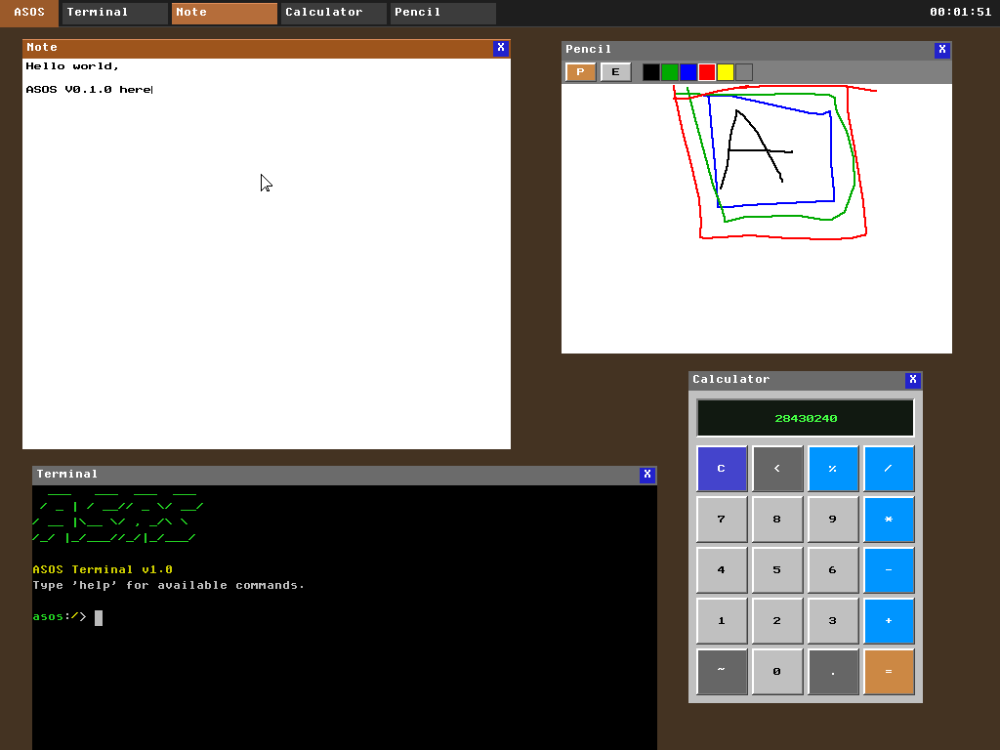

# ASOS (in active development)

ASOS is a vibe coded, hobbyist-driven, independent OS featuring a bespoke microkernel architecture designed for the hardware of today, not the constraints of the 90s.



Languages of choice:
- Assembly
- C

## Parts:
- UEFI bootloder
- CPU Mode Setup
- Kernel with memory management (starting monolithic, will refactor towards microkernel. Will design internal APIs from the start to be message-passing-friendly so the refactor isn't a rewrite)
- PCI enumeration
- GDT/IDT setup, Interrupt and Exception Handling, keyboard input
- Timer driver (PIT or HPET/APIC timer)
- Serial output for debugging
- Device Drivers (Minimum Viable Set)
- Implement FAT32 filesystem
- Process Management and Scheduling
- System Calls
- User Space: An ELF loader, A minimal C runtime, A simple shell

## Milestones:
- [x] UEFI application loads the kernel ELF into memory, sets up a framebuffer via GOP, exits boot services, and jumps to the kernel. The kernel prints "ASOS" to both serial and screen
- [x] Set up a proper 64-bit GDT, load an IDT, wire up exception handlers (at minimum: division error, page fault, general protection fault, double fault). At this point, a fault gives you a diagnostic message instead of a triple-fault reboot
- [x] Physical memory manager + virtual memory: Parse the UEFI memory map, build a physical frame allocator (bitmap or buddy), set up your own page tables (replacing the UEFI-provided ones), and get a kernel heap working (a simple slab or bump allocator to start). Let's go bitmap allocator for now. go with a simple free-list allocator. map the kernel at a higher-half virtual address
- [x] Interrupts, keyboard, timer: PIC or APIC initialization, PS/2 keyboard driver (VirtualBox emulates this), PIT or APIC timer. After this, you can type characters and measure time. Let's go wit PIT  for now. Go PIT for now. Program it to fire at 1000 Hz (1ms tick), which gives us reasonable scheduling granularity later.
- [x] Storage + FAT32 read support: ATA/AHCI driver (VirtualBox supports both), partition table parsing, read-only FAT32. You can now load files from disk. ATA PIO for now. Use a separate raw FAT32 disk image as a second drive. No partition table parsing at all, the entire disk is one FAT32 filesystem
- [x] 6A, 6B, 6C: Process management, scheduler, context switching: Kernel threads first, then ring-3 user processes. Round-robin scheduler. TSS setup for ring transitions
- [x] 7A, 7B: Syscall interface + ELF loader: syscall/sysret on x86_64, a minimal syscall table (write, read, exit, exec), ELF64 loading from your FAT32 volume
- [x] 8A, 8B: Minimal C runtime + shell: A tiny libc (just enough for printf, malloc, basic string ops), and a shell that reads commands and launches ELF binaries
- [x] Add another kernel syscall "SYS_READDIR" to support a shell command to be added later "l" which is similar to "ls"
- [x] Add a kernel syscall that can fetch the pid of a process by name, in order to later support a shell command "pidof"
- [x] Add more kernel syscalls SYS_KILL and SYS_PROCLIST or similar (to support the "end" command, which is similar to "kill")
- [x] Add support for a working directory concept (to support the later implementation of the shell command "path", which is similar to "pwd")
- [ ] Add a syscall to report total/used/free space from the FAT32 volume (to support the "disk" command)
- [ ] Implement support for file read with offset/size control
- [ ] Add write support for the FAT32 file system
- [ ] Add basic ASOS shell commands (help, ls/l, cd/go, pwd/path, mkdir/md, touch/new, cp/copy, mv/move, rm/del, cat/show, head/top, tail/bottom, echo/say, kill/end, df/disk, clear/clean)
- [ ] PS/2 mouse Drivers
- [ ] Graphics framebuffer library
- [ ] Window manager and compositor
- [ ] Desktop environment
- [ ] GUI toolkit and syscall API for apps
- [ ] Basic desktop apps: calculator, text editor, file manager, system settings, drawing app, a system monitor, terminal emulator, image viewer
- [ ] PCI bus enumeration
- [ ] Network interface driver
- [ ] TCP/IP stack
- [ ] Add more advanced shell commands (grep/find, top/proc, chmod/perm, ping/test, ifconfig/ip)
- [ ] DNS resolver and sockets API
- [ ] Enhancement: Swap bitmap allocator with a buddy allocator
- [ ] Enhancement: Write an AHCI driver that implements the same block device interface and swap it in
- [ ] Enhancement: Drop in a slab allocator for better performance
- [ ] Enhancement: Add APIC support and disable the PIC at that point
- [ ] Enhancement: Refactor towards a microkernel

## Local Dev
- `make` to build everything + compile the vdi disk files (boot disk + data disk)
- `make run` to run the OS using Qemu (exit using ctrl+a -> x)

## Dependencies
```
sudo apt-get update && sudo apt-get install libfdt1
sudo apt-get update && sudo apt-get install libpmem1
sudo apt-get update && sudo apt-get install -y librdmacm1 libslirp0 liburing2 libaio1t64
sudo apt-get update && sudo apt-get install -y qemu-system-x86
```
